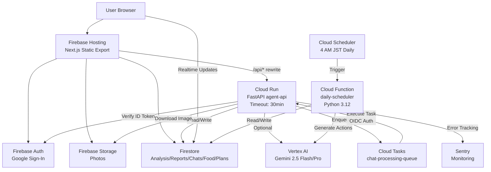
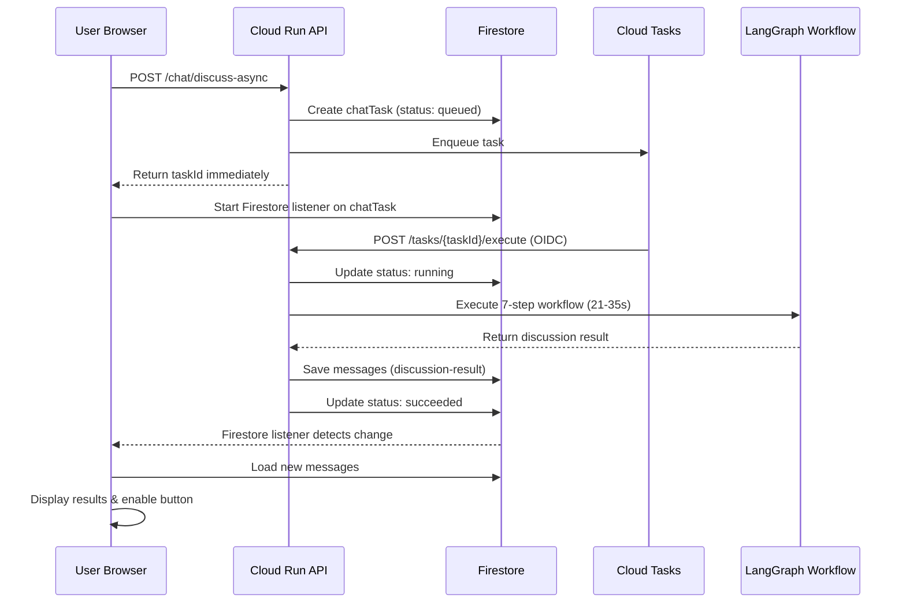

# HairGuard Agent

薄毛対策の継続を支えるAIエージェント
**写真分析・メンタルサポート・習慣化支援を統合したフルスタックMVP**
---

## 1. 解決する課題

薄毛対策は長期的な取り組みが必要だが、**継続が最大の課題**：

- **孤独な戦い**: 誰にも相談できず、モチベーション維持が困難
- **効果の不可視性**: 変化が緩やかで、進捗が実感しにくい
- **情報過多**: ネット上の情報が多すぎて、何をすべきか分からない
- **習慣化の壁**: 良い習慣を定着させるのが難しい

---

## 2. ソリューションアプローチ

HairGuardは**AI×データ×パーソナライゼーション**で継続をサポート：

### 📸 可視化による進捗実感
- 写真ベースの髪密度分析（性別対応型：Hamilton-Norwood / Ludwig スケール）
- 時系列グラフで変化を可視化
- 週次AIレポートで成長を実感

### 🧠 メンタル・シールド
- 3人格エージェント（❤️サポーター・💪コーチ・🔬ドクター）による多角的サポート
- 非同期処理（Cloud Tasks統合）で深い議論を実現
- ユーザーの悩みに寄り添った共感的対話

### 📅 週間プラン自動管理（Phase 2完了）
- 傾向スコアに基づく週次プラン生成
- **Cloud Function による完全自動化**: 毎日午前4時にログ確定・アクション生成
- ユーザーは何もしなくても習慣化をサポート

### 🍽️ 食材スナイパー
- 位置情報ベースの食材・店舗提案
- 髪に良い栄養素を考慮した推奨

---

## 3. システムアーキテクチャ



**特徴**:
- **フロントエンド**: Next.js 16 (Static Export) → Firebase Hosting
- **バックエンド**: FastAPI (Cloud Run) → 30分タイムアウト、非同期処理対応
- **AI基盤**: Vertex AI (Gemini 2.5 Flash / Pro)
- **タスクキュー**: Cloud Tasks（OIDC認証、最大3回リトライ）
- **自動化**: Cloud Function + Cloud Scheduler（毎日午前4時JST実行）

---

## 4. 主要機能フロー

### 4.1 非同期チャット処理（Phase 1-3完了）



**特徴**:
- 3人格エージェント × 2ラウンド + まとめ役（計7ステップ）
- LangGraphによる構造化ワークフロー
- Firestoreリアルタイムリスナーで状態同期
- リロード時の復旧機能（10分以内自動再開）

### 4.2 週間プラン自動管理（Phase 2完了）

**毎日午前4時JST**:
1. **前日ログ自動確定**: `users/{uid}/plans/{planId}/logs/{yesterday}` → `isConfirmed: true`
2. **当日アクション自動生成**: `users/{uid}/plans/{planId}/dailyActions/{today}` → 傾向スコアから3つのアクション生成

**エラーハンドリング**:
- ユーザー単位・プラン単位で分離
- 1人のエラーが他のユーザーに影響しない
- 部分成功レポート

---

## 5. 技術スタック・インフラ

### フロントエンド
- **Next.js** 16.1.6 (App Router, Static Export)
- **React** 19.2
- **Firebase SDK** 12.8 (Auth/Firestore/Storage)
- **Framer Motion** (アニメーション)
- **lucide-react** (アイコン)

### バックエンド
- **FastAPI** 0.128.0 (Python 3.12)
- **Firebase Admin SDK** 7.1.0
- **LangGraph** (LLMワークフロー)
- **Sentry SDK** 2.22.0 (エラー監視)
- **Pillow** 12.1.0 (画像処理)

### AI・LLM
- **Vertex AI** (Google Cloud)
- **Gemini 2.5 Flash** (高速推論、300文字程度)
- **Gemini 2.5 Pro** (詳細推論、600文字程度)
- **Gemini Vision** (画像解析 - 性別対応型髪分析)

### インフラ
| サービス | 用途 | リージョン |
|---------|------|-----------|
| **Firebase Hosting** | フロントエンド配信 | Global |
| **Cloud Run** | API実行基盤（30分タイムアウト、1Gi、CPU1） | asia-northeast1 |
| **Cloud Functions** | 日次自動処理（512MB、9分タイムアウト） | asia-northeast1 |
| **Cloud Scheduler** | 定期実行（毎日午前4時JST） | asia-northeast1 |
| **Cloud Tasks** | 非同期タスクキュー（最大3回リトライ） | asia-northeast1 |
| **Firestore** | データストア | asia-northeast1 |
| **Cloud Storage** | 画像保存 | asia-northeast1 |
| **Sentry** | エラートラッキング、パフォーマンス監視 | - |

---

## 6. 実装例・デモ

### ホーム画面（パーソナライズドダッシュボード）

**並列API取得による高速化**（2050ms → 500ms、**4倍改善**）:
1. `/api/v1/lifestyle/mission` - 今日のミッション（3つ）
2. `/api/v1/mental-shield/motivation` - AIモチベーションメッセージ
3. `/api/v1/lifestyle/quick-action` - 時間帯別5分アクション提案
4. `/api/v1/lifestyle/quick-qa` - concernArea連動質問（3つ）

**スケルトンローディング**: 固定レイアウトで Cumulative Layout Shift を最小化（0.25+ → <0.1目標）

### AIモチベーションメッセージ生成

**入力**: ユーザーのアクティビティメトリクス（写真撮影頻度、食事記録、プラン実行状況、弱点軸）

**出力例**:
```json
{
  "message": "今週は食事記録を4回も達成しました。小さな継続が大きな変化を生みます",
  "source": "generated",
  "generatedAt": "2026-02-14T09:00:00+09:00"
}
```

**キャッシュ**: Firestoreに日次キャッシュ（TTL: 翌日4:00AM JST）

### 週間プラン生成

**入力**: 傾向スコア（`stress_management: 65`, `self_care: 45`, `social_connection: 30`）

**Gemini生成例**:
```json
{
  "theme": "生活リズムを整えて、前向きな気持ちで過ごす",
  "targetActions": [
    {
      "id": "action_1",
      "name": "朝のルーティン",
      "category": "lifestyle",
      "description": "毎朝同じ時間に起きて、軽いストレッチをする",
      "difficultyScore": 3,
      "impactScore": 8
    }
  ]
}
```

**期間**: 月曜日 00:00:00 - 日曜日 23:59:59（JST）
**自動化**: 午前4時前は前日扱い

---

## 7. 信頼性・パフォーマンス

### 非同期処理の信頼性
- **Cloud Tasks統合**: OIDC認証、最大3回リトライ、5分最大リトライ期間
- **タイムアウト管理**: Cloud Run 30分、Firestore chatTasks TTL 30分
- **リカバリー**: リロード時の未完了タスク自動復旧（10分以内）
- **状態同期**: Firestoreリアルタイムリスナー + ポーリングフォールバック

### パフォーマンス最適化実績

| 指標 | Before | After | 改善率 |
|------|--------|-------|--------|
| **Time to Interactive** | ~2050ms | ~500ms | **4倍高速化** |
| **再レンダリング回数** | 5回 | 1回 | **5分の1** |
| **Cumulative Layout Shift** | 0.25+ | <0.1目標 | **大幅削減** |

**手法**:
- 並列API呼び出し（`Promise.allSettled()`）
- 単一状態更新（8つ → 3つの独立state統合）
- スケルトンローディング（固定レイアウト）
- アニメーション最適化（初回のみ実行）

### 最新の改善（2026-02-15）
- **UI/UX**: Dashboard/Reportページにプログレスバー付きローディング実装
- **AIカメラ**: 手動撮影ボタンを品質チェック不要に変更（ユーザー要望対応）
- **セキュリティ**: console.error削除で内部エラー情報の外部露出を防止
- **パフォーマンス**: requestAnimationFrameループ最適化、カメラ権限の遅延要求でCPU使用率削減
- **コード品質**: photoIdのURLエンコード、撮影指示テキストの統一

### エラー監視（Sentry統合）
- **エラートラッキング**: 全例外を自動キャプチャ
- **パフォーマンス監視**: トランザクション、プロファイリング
- **センシティブ情報のサニタイズ**: パスワード、トークン、APIキーを自動削除
- **サンプリングレート**: 本番10%、開発100%

### セキュリティ
- **認証**: Firebase ID Token検証（全APIエンドポイント）
- **認可**: Firestoreルール（`request.auth.uid == uid` のみ許可）
- **ストレージパス検証**: 正規表現による厳密な検証
- **レート制限**: `slowapi`（`/chat/discuss-async`: 10リクエスト/分）
- **情報漏洩対策**: エラー情報の適切なサニタイズ（2026-02-15実装）

---

## 8. クイックスタート

### 前提条件
- **Node.js** 20+
- **Python** 3.12+
- **Firebase CLI** (`npm install -g firebase-tools`)
- **gcloud CLI** ([インストールガイド](https://cloud.google.com/sdk/docs/install))

### ローカル開発

**1. フロントエンド**
```bash
cd apps/web
cp .env.example .env.local
# .env.local に Firebase設定を記入
npm install
npm run dev
# → http://localhost:3000
```

**2. バックエンド（別ターミナル）**
```bash
cd services/agent-api
python3.12 -m venv venv
source venv/bin/activate
pip install -r requirements.txt
uvicorn app.main:app --reload --port 8000
# → http://localhost:8000/api/health
```

### デプロイ

**フロントエンド（Firebase Hosting）**
```bash
firebase deploy --only hosting
```

**バックエンド（Cloud Run）**
```bash
cd services/agent-api
gcloud run deploy agent-api \
  --source . \
  --region asia-northeast1 \
  --timeout 1800s \
  --memory 1Gi \
  --set-env-vars FIREBASE_PROJECT_ID=hackason-grab,...
```

**Cloud Function（週間プラン自動管理）**
```bash
cd cloud-functions/daily-scheduler
./deploy.sh          # Cloud Function デプロイ
./setup-scheduler.sh # Cloud Scheduler 設定
```

---

## 9. プロジェクト構成

```
hackason-grab/
├─ apps/
│  └─ web/                         # Next.js (フロントエンド)
│     ├─ src/app/                  # 画面実装
│     │  ├─ feature2/chat/         # 非同期チャット (Phase 1-3)
│     │  ├─ feature3/weekly-plan/  # 週間プラン (Phase 2)
│     │  ├─ mental-shield/         # 同期版チャット
│     │  ├─ dashboard/
│     │  └─ home/                  # パーソナライズドダッシュボード
│     ├─ src/lib/                  # Firebase初期化
│     └─ .env.local                # ローカル環境変数
├─ services/
│  └─ agent-api/                   # FastAPI (Cloud Run)
│     ├─ app/
│     │  ├─ routers/
│     │  │  ├─ mental_shield.py   # LangGraphワークフロー、非同期エンドポイント
│     │  │  ├─ lifestyle.py       # 週間プラン、ミッション、Quick Action/Q&A
│     │  │  └─ photos.py          # 性別対応型髪分析
│     │  ├─ agents/lifestyle_agent/tools/
│     │  │  ├─ generate_plan.py   # 週間プラン・日次アクション生成
│     │  │  └─ recommend_actions.py  # ACTIONS_CATALOG
│     │  ├─ monitoring/
│     │  │  └─ sentry.py          # Sentry統合
│     │  └─ firebase.py            # Firebase初期化
│     └─ requirements.txt
├─ cloud-functions/                # Cloud Functions (Phase 2)
│  └─ daily-scheduler/             # 毎日午前4時の自動処理
│     ├─ main.py                   # エントリーポイント
│     ├─ requirements.txt
│     ├─ .env.yaml                 # 環境変数
│     ├─ shared/                   # agent-apiからの再利用コード
│     ├─ deploy.sh
│     └─ setup-scheduler.sh
├─ .github/workflows/
│  ├─ cloud-run-deploy.yml         # Cloud Run CI/CD
│  └─ firebase-hosting-merge.yml   # Firebase Hosting CI/CD
├─ firestore.rules
├─ firestore.indexes.json
├─ storage.rules
├─ firebase.json
├─ docs/
│  └─ system_spec.md               # システム仕様書（詳細）
└─ README.md                       # 本ドキュメント
```

---

## 10. 今後の展開
### 機能拡張（検討中）
- プッシュ通知（タスク完了時、週間プラン更新時）
- チャット履歴のエクスポート
- カスタムエージェント設定
- 多言語対応（英語、中国語）

### インフラ改善
- Cloud Runのコールドスタート最適化
- Cloud Functionsのリトライ戦略強化
- Firestoreインデックス最適化

---

## 関連ドキュメント

- **[システム仕様書](docs/system_spec.md)** - システム全体の詳細設計、アーキテクチャ、API仕様、変更履歴
  - Phase 2（週間プラン自動化）の実装詳細
  - Phase 4（チャット性能改善）の提案
  - セキュリティ、パフォーマンス、エラーハンドリング
  - デプロイ手順、トラブルシューティング
- **[Cloud Function運用ガイド](cloud-functions/daily-scheduler/README.md)** - 日次自動処理のデプロイ・運用

---

## トラブルシューティング

### ログインできない
**原因**: Firebase Authenticationの設定不足
**解決**: Firebase Console → Authentication → Sign-in method → Google を有効化

### API接続エラー
**原因**: 環境変数の設定ミス
**解決**: `NEXT_PUBLIC_API_BASE` が正しいか確認（ローカル: `http://localhost:8000`、本番: Cloud Run URL）

### チャットタスクが実行されない
**原因**: Cloud Tasksの設定ミス
**解決**:
```bash
# タスク詳細確認
gcloud tasks describe <task-name> --queue=chat-processing-queue --location=asia-northeast1

# ログ確認
gcloud logging read 'resource.labels.service_name="agent-api" AND textPayload=~"Task"' --limit 20
```

### Cloud Functionが実行されない
**原因**: Cloud Schedulerの設定ミス
**解決**:
```bash
# スケジュール状態確認
gcloud scheduler jobs describe daily-scheduler-4am-jst --location=asia-northeast1

# 手動実行（テスト）
gcloud scheduler jobs run daily-scheduler-4am-jst --location=asia-northeast1

# ログ確認
gcloud functions logs read daily-scheduler --region=asia-northeast1 --limit=50
```

---

**最終更新**: 2026-02-15
