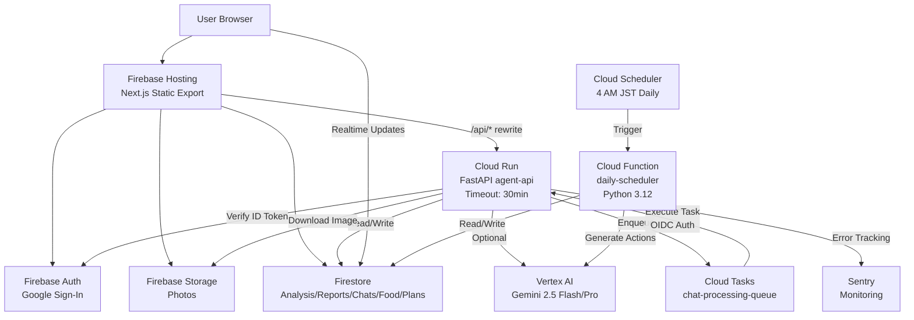
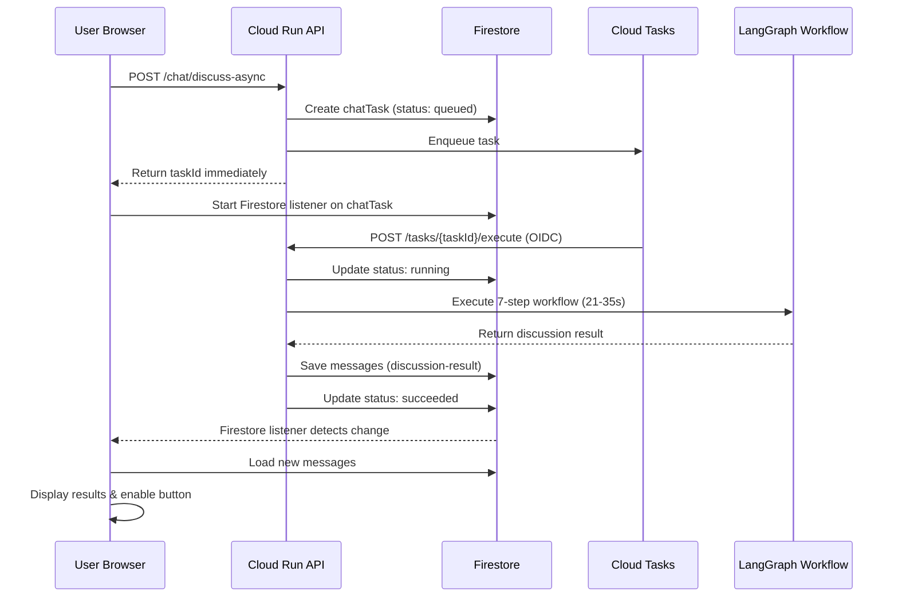

# HairGuard Agent システム仕様書

最終更新: 2026-02-14

## 1. 概要
薄毛対策の継続を支えるMVP。
Firebase Hosting + Cloud Run + Cloud Functions + Firebase（Auth/Firestore/Storage）を中心に構成し、レポート/メンタル支援は Vertex AI（Gemini）連携に対応。

**Phase 1-3実装完了**: 非同期チャット処理、Cloud Tasks統合、Sentry監視
**Phase 2実装完了**: 週間プラン機能（Cloud Function による完全自動化 - 毎日午前4時のログ自動確定・アクション自動生成）
**最新機能**: ホーム画面UX最適化（スケルトンローディング、並列API取得）、性別対応型髪分析、AIモチベーションメッセージ、Quick Q&A機能、週間プラン自動管理

---

## 2. システム構成 / アーキテクチャ

### 2.1 システム全体図



### 2.2 非同期チャット処理フロー（Phase 1-3）



### 2.3 実行基盤
- **フロント**: Next.js（Static Export）を Firebase Hosting へデプロイ
- **API**: Cloud Run `agent-api` (region: `asia-northeast1`)
  - タイムアウト: **30分** (1800秒)
  - メモリ: 1Gi
  - CPU: 1
  - 並行性: 80
  - 最小インスタンス: 0
  - 最大インスタンス: 10
- **AI**: Vertex AI（Gemini 2.5 Flash / Pro）
- **タスクキュー**: Cloud Tasks `chat-processing-queue`
  - リージョン: asia-northeast1
  - 最大リトライ: 3回
  - 最大リトライ期間: 5分
- **監視**: Sentry（エラートラッキング、パフォーマンス監視）

### 2.4 リライト設定
`firebase.json` の `hosting.rewrites` により `/api/**` を Cloud Run に転送。

### 2.5 Cloud Function（週間プラン自動管理）

**関数名**: `daily-scheduler`
**リージョン**: `asia-northeast1`
**ランタイム**: Python 3.12
**トリガー**: Cloud Scheduler（毎日午前4時 JST）

#### 処理内容

1. **前日のログ自動確定**
   - Firestore: `users/{uid}/plans/{planId}/logs/{yesterday}`
   - ログが存在する場合: `isConfirmed: false` → `true` に更新、`autoConfirmedAt` タイムスタンプを追加
   - ログが存在しない場合: 空のログを作成して `isConfirmed: true` を設定

2. **当日のアクション自動生成**
   - Firestore: `users/{uid}/plans/{planId}/dailyActions/{today}`
   - 処理フロー:
     - ユーザーの `tendencyScores/latest` からスコアを取得
     - アクティブなプランを検索（期間内 & status: active）
     - プラン期間内で、`dailyActions` が未作成の場合のみ生成
     - `generate_daily_actions()` で3つのアクションを生成
     - Firestore に保存（`autoGenerated: true` フラグ付き）

#### 実行基盤

- **メモリ**: 512MB
- **タイムアウト**: 9分（540秒）
- **最小インスタンス**: 0
- **最大インスタンス**: 1
- **認証**: Cloud Scheduler から OIDC Token で呼び出し

#### エラーハンドリング

- **ユーザー単位で分離**: 1人のエラーが他のユーザーに影響しない
- **プラン単位で分離**: 1つのプランのエラーが他のプランに影響しない
- **詳細なログ出力**: 各処理の成功/失敗をログに記録
- **部分成功のレポート**: 一部失敗しても成功した件数を返却

#### デプロイ

```bash
cd cloud-functions/daily-scheduler
./deploy.sh          # Cloud Function デプロイ
./setup-scheduler.sh # Cloud Scheduler 設定
```

#### モニタリング

```bash
# ログ確認
gcloud functions logs read daily-scheduler \
  --region=asia-northeast1 \
  --project=hackason-grab \
  --limit=50

# スケジュール状態確認
gcloud scheduler jobs describe daily-scheduler-4am-jst \
  --location=asia-northeast1 \
  --project=hackason-grab

# 手動実行（テスト）
gcloud scheduler jobs run daily-scheduler-4am-jst \
  --location=asia-northeast1 \
  --project=hackason-grab
```

---

## 3. フロントエンド

### 3.1 技術
- Next.js 16 (App Router)
- Firebase Web SDK（Auth/Firestore/Storage）
- Static Export (`output: "export"`)
- Framer Motion（アニメーション）
- Firebase v12.8
- lucide-react（アイコン）
- **デザインシステム**: FLUX-inspired blue theme
  - Primary Accent: `#0693e3` (cyan blue)
  - Accent Strong: `#0570b8` (darker blue)
  - Accent Soft: `#e0f2fe` (light blue)
  - Accent Secondary: `#FEFE2D` (yellow)
  - 40+ファイルで統一された色パレット

### 3.2 画面一覧
| 画面 | パス | 概要 |
|---|---|---|
| **Home** | `/home` | **パーソナライズドダッシュボード（今日のミッション、Quick Action、Quick Q&A、AIモチベーションメッセージ）** |
| Login | `/login` | Googleログイン |
| Check-in | `/checkin` | 写真アップロード & 解析起動 |
| Dashboard | `/dashboard` | 進捗グラフ / 週次レポート |
| Mental Shield | `/mental-shield` | 3人格の相談回答（旧同期版） |
| **Feature2 Chat** | `/feature2/chat` | **非同期チャット（Phase 1-3実装）+ Quick Q&A自動入力対応** |
| Food Sniper | `/food-sniper` | 食材 & 店舗提案 + 履歴 |

### 3.3 Home 画面の実装詳細

**ファイル**: `apps/web/src/app/home/page.jsx`

**主要機能**:
1. **並列API取得**: 4つのAPIを `Promise.allSettled()` で同時実行
   - `/api/v1/lifestyle/mission` - 今日のミッション（3つ）
   - `/api/v1/mental-shield/motivation` - AIモチベーションメッセージ
   - `/api/v1/lifestyle/quick-action` - 時間帯別5分アクション提案
   - `/api/v1/lifestyle/quick-qa` - concernArea連動質問（3つ）

2. **スケルトンローディング**: 読み込み中に固定レイアウトを表示
   - `GreetingSkeleton` - 挨拶セクション
   - `StatusCardSkeleton` - 継続記録カード
   - `MissionsSectionSkeleton` - ミッションセクション
   - `SectionPlaceholder` - Quick Action / Q&A

3. **パフォーマンス最適化**:
   - **状態統合**: 8つの独立state → 3つ（profile, homeData, showGuide）
   - **単一レンダリング**: 1回のsetStateで全データ更新
   - **アニメーション最適化**: 初回のみ実行（`isFirstLoad` フラグ）

4. **Quick Q&A連携**: 質問タップでChat画面に自動遷移
   - SessionStorageに質問を保存
   - `/feature2/chat` に遷移後、入力フィールドに自動展開

**パフォーマンス改善結果**:
| 指標 | Before | After | 改善率 |
|------|--------|-------|--------|
| Time to Interactive | ~2050ms | ~500ms | 4倍高速化 |
| 再レンダリング回数 | 5回 | 1回 | 5分の1 |
| Cumulative Layout Shift | 0.25+ | <0.1目標 | 大幅削減 |

### 3.4 Feature2 Chat の実装詳細

**ファイル**: `apps/web/src/app/feature2/chat/page.jsx`

**主要機能**:
1. **非同期メッセージ送信**: `handleSendAsync()`
   - `/api/v1/mental-shield/chat/discuss-async` を呼び出し
   - タスクIDを即座に取得
   - LocalStorageに保存（`pending_chat_task`, `pending_chat_thread`）

2. **リアルタイム状態監視**: Firestoreリスナー + ポーリングフォールバック
   - **Phase 2**: `startListening()` - Firestoreリアルタイムリスナー
   - **Phase 1**: `startPolling()` - 3秒間隔ポーリング（フォールバック）

3. **リロード時の復旧**: `useEffect()` で未完了タスクを自動復旧
   - 10分以内: リスナーを再開
   - 10分超過: Firestoreで最終状態を確認して表示

4. **UIボタン制御**: `pendingTaskId` が存在する間、送信ボタンを無効化

5. **discussion-result表示**:
   - サマリーを最上部に表示
   - 「議論の過程を見る」ボタンで6人のエージェント発言を折り畳み表示

### 3.4 フロント環境変数（例）
`.env.local` もしくは GitHub Actions Secrets で設定。
- `NEXT_PUBLIC_FIREBASE_API_KEY`
- `NEXT_PUBLIC_FIREBASE_AUTH_DOMAIN`
- `NEXT_PUBLIC_FIREBASE_PROJECT_ID`
- `NEXT_PUBLIC_FIREBASE_STORAGE_BUCKET`
- `NEXT_PUBLIC_FIREBASE_MESSAGING_SENDER_ID`
- `NEXT_PUBLIC_FIREBASE_APP_ID`
- `NEXT_PUBLIC_DIRECT_API_URL`（Cloud Run URL、デフォルト: `https://agent-api-7wsihnjf7q-an.a.run.app`）

---

## 4. バックエンド（Cloud Run / FastAPI）

### 4.1 認証
全 API は Firebase ID Token を `Authorization: Bearer <token>` で検証。

**例外**: `/api/v1/mental-shield/tasks/{taskId}/execute` は **OIDC Token** で認証（Cloud Tasks専用）

### 4.2 エンドポイント一覧
| メソッド | パス | 説明 | 認証 |
|---|---|---|---|
| GET | `/api/health` | ヘルスチェック | 不要 |
| **POST** | `/api/v1/photos/analyze` | **画像解析（性別対応：Hamilton-Norwood/Ludwig）** | 必須 |
| POST | `/api/v1/reports/generate` | 週次レポート生成 | 必須 |
| POST | `/api/v1/mental-shield/chat` | 3人格メンタル支援（同期版） | 必須 |
| **POST** | `/api/v1/mental-shield/chat/discuss-async` | **非同期チャット（Phase 1-3）** | 必須 |
| **POST** | `/api/v1/mental-shield/tasks/{taskId}/execute` | **タスク実行（Cloud Tasks専用）** | OIDC |
| **GET** | `/api/v1/mental-shield/tasks/{taskId}` | **タスク状態取得** | 必須 |
| **GET** | `/api/v1/mental-shield/motivation` | **AIモチベーションメッセージ生成** | 必須 |
| **GET** | `/api/v1/lifestyle/mission` | **今日のミッション（3つ）** | 必須 |
| **GET** | `/api/v1/lifestyle/quick-action` | **時間帯別5分アクション提案** | 必須 |
| **GET** | `/api/v1/lifestyle/quick-qa` | **concernArea連動質問（3つ）** | 必須 |
| **POST** | `/api/v1/lifestyle/plan/generate` | **週間プラン生成（月曜-日曜）** | 必須 |
| **POST** | `/api/v1/lifestyle/plan/daily/generate` | **日次アクション生成（週次プラン自動作成対応）** | 必須 |
| **GET** | `/api/v1/lifestyle/plan/current` | **現在の週次プラン取得** | 必須 |
| POST | `/api/v1/food-sniper/recommend` | 食材/店舗提案 | 必須 |

### 4.3 主要リクエスト/レスポンス概要

#### `/api/v1/mental-shield/chat/discuss-async` （新規）
- **入力**:
  ```json
  {
    "threadId": "default",
    "message": "最近抜け毛が増えて心配です",
    "mode": "balanced",
    "style": "balanced",
    "detail": "flash"
  }
  ```
- **即座レスポンス**:
  ```json
  {
    "taskId": "uuid-v4",
    "status": "queued"
  }
  ```
- **処理フロー**:
  1. Firestoreに `users/{uid}/chatTasks/{taskId}` を作成
  2. 本番環境: Cloud Tasksにenqueue
  3. 開発環境: バックグラウンドスレッドで実行

#### `/api/v1/mental-shield/tasks/{taskId}` （新規）
- **出力**:
  ```json
  {
    "userId": "uid",
    "conversationId": "default",
    "status": "queued|running|succeeded|failed|timeout",
    "mode": "flash|pro",
    "createdAt": "2026-02-11T10:00:00Z",
    "startedAt": "2026-02-11T10:00:01Z",
    "finishedAt": "2026-02-11T10:00:35Z",
    "messageId": "msg-id",
    "error": null
  }
  ```

#### `/api/v1/mental-shield/motivation` （新規）
- **入力**: なし（認証されたユーザーのuidから自動取得）
- **出力**:
  ```json
  {
    "message": "今週は食事記録を4回も達成しました。小さな継続が大きな変化を生みます",
    "source": "generated|cached|fallback",
    "generatedAt": "2026-02-12T09:00:00+09:00"
  }
  ```
- **生成ロジック**:
  - ユーザーアクティビティメトリクスを分析（写真撮影頻度、食事記録、プラン実行状況、弱点軸）
  - Geminiで具体的な行動を褒めるメッセージを生成
  - Firestoreに日次キャッシュ（TTL: 翌日4:00AM JST）

#### `/api/v1/lifestyle/mission` （新規）
- **入力**: なし（認証されたユーザーのuidから自動取得）
- **出力**:
  ```json
  {
    "missions": [
      {
        "id": "mission_1",
        "name": "今日の状態を記録しましょう",
        "emoji": "📸",
        "description": "定期的な写真撮影で変化を追跡",
        "actionType": "reminder",
        "targetUrl": "/feature1/capture",
        "priority": "high"
      }
    ],
    "source": "generated|cached|fallback"
  }
  ```
- **生成ロジック**:
  - ユーザーアクティビティを分析（長期未実施項目、弱点軸）
  - Geminiで優先順位付きの3つのミッションを生成
  - Firestoreに日次キャッシュ

#### `/api/v1/lifestyle/quick-action` （新規）
- **入力**: なし（現在時刻とユーザーアクティビティから自動判定）
- **出力**:
  ```json
  {
    "action": "朝食に亜鉛豊富なナッツを追加",
    "time_label": "朝",
    "guide": "1. アーモンド、カシューナッツ、くるみなどを用意\n2. 朝食に一握り（20-30g）追加\n3. よく噛んで食べる",
    "duration_minutes": 5,
    "source": "generated|cached|fallback",
    "generatedAt": "2026-02-12T08:30:00+09:00"
  }
  ```
- **時間帯別フォールバック**:
  - 朝（5-11時）: 栄養系アクション
  - 昼（11-17時）: マッサージ/運動系アクション
  - 夜（17時-）: リラックス系アクション

#### `/api/v1/lifestyle/quick-qa` （新規）
- **入力**: なし（ユーザーのconcernAreasから自動取得）
- **出力**:
  ```json
  {
    "questions": [
      "生え際の後退を防ぐには？",
      "ストレス性の薄毛対策は？",
      "今日からできるケアを教えて"
    ],
    "source": "personalized|fallback",
    "generatedAt": "2026-02-12T09:00:00+09:00"
  }
  ```
- **質問選択ロジック**:
  - concernAreas（thinning, hairline, crown, volume, shedding, scalp, stress, postpartum, prevention）ごとに3つの質問を事前定義
  - ユーザーの上位3つのconcernから各1つランダム選択
  - concernAreasが未設定の場合はフォールバック質問3つ

#### `/api/v1/lifestyle/plan/generate` （週間プラン生成）
- **入力**: なし（認証されたユーザーのtendencyScoresから自動取得）
- **出力**:
  ```json
  {
    "planId": "plan_20260210_uuid",
    "startDate": "2026-02-10T00:00:00+09:00",
    "endDate": "2026-02-16T23:59:59+09:00",
    "theme": "生活リズムを整えて、前向きな気持ちで過ごす",
    "targetActions": [
      {
        "id": "action_1",
        "name": "朝のルーティン",
        "category": "lifestyle",
        "description": "毎朝同じ時間に起きて、軽いストレッチをする",
        "difficultyScore": 3,
        "impactScore": 8
      }
    ],
    "status": "active",
    "createdAt": "2026-02-10T09:00:00+09:00",
    "createdScores": {
      "stress_management": 65,
      "self_care": 45,
      "social_connection": 30
    }
  }
  ```
- **生成ロジック**:
  - 今週の月曜日-日曜日を自動計算（午前4時前は前日扱い）
  - ユーザーの傾向スコアから弱点軸を特定
  - Geminiで週間テーマと3つのアクションを生成
  - Firestoreに保存、古いアクティブプランは `completed` に変更

#### `/api/v1/lifestyle/plan/daily/generate` （日次アクション生成）
- **入力**:
  ```json
  {
    "planId": "plan_20260210_uuid"  // オプショナル
  }
  ```
- **出力**:
  ```json
  {
    "planId": "plan_20260210_uuid",
    "date": "2026-02-14",
    "actions": [
      {
        "targetActionId": "action_1",
        "name": "朝のルーティン",
        "completed": false,
        "completedAt": null
      }
    ],
    "autoGenerated": true,
    "generatedAt": "2026-02-14T04:00:00+09:00"
  }
  ```
- **自動プラン作成ロジック**:
  - `planId` が未指定の場合、アクティブな週次プランを自動検索
  - アクティブなプランがなければ、`/plan/generate` を自動呼び出しして新規作成
  - 作成したプランIDで日次アクション生成を続行
- **用途**: ユーザーが手動でプラン作成しなくても、ミッション生成時に週次プランが自動作成される

#### `/api/v1/lifestyle/plan/current` （現在の週次プラン取得）
- **入力**: なし（認証されたユーザーから自動取得）
- **出力**:
  ```json
  {
    "planId": "plan_20260210_uuid",
    "startDate": "2026-02-10T00:00:00+09:00",
    "endDate": "2026-02-16T23:59:59+09:00",
    "theme": "生活リズムを整えて、前向きな気持ちで過ごす",
    "targetActions": [...],
    "dailyActions": {
      "2026-02-14": {
        "actions": [...],
        "autoGenerated": true,
        "generatedAt": "2026-02-14T04:00:00+09:00"
      }
    },
    "logs": {
      "2026-02-13": {
        "isConfirmed": true,
        "autoConfirmedAt": "2026-02-14T04:00:00+09:00"
      }
    },
    "status": "active"
  }
  ```

#### 既存エンドポイント
- `/api/v1/photos/analyze`
  - 入力: `photoId`, `storagePath`, `capturedAt`, `roiPreset`, **`gender`（新規）**
  - 出力: `densityIndex`, `deltaVsPrev`, `deltaVsBase`, `quality`, `analysisId`, **`hairType`, `pattern`（新規）**
  - **性別対応**: 男性=Hamilton-Norwood（M字/O字/U字）、女性=Ludwig（びまん性/オルセン型/ハミルトン型）
- `/api/v1/reports/generate`
  - 入力: `periodDays`
  - 出力: `highlights`, `nextActions`, `rawText`
- `/api/v1/mental-shield/chat`（同期版）
  - 入力: `threadId`, `message`, `mode`
  - 出力: `cards[{agent,text}]`, `summary`
- `/api/v1/food-sniper/recommend`
  - 入力: `message`, `location{lat,lng,accuracyM}`, `radiusM`
  - 出力: `items`, `stores`, `shoppingList`

### 4.4 LangGraph ワークフロー詳細

**ファイル**: `services/agent-api/app/routers/mental_shield.py:217-622`

#### ワークフロー構造
```
START
  ↓
detect_risk (リスクキーワード検出)
  ↓
Round 1 (初期議論):
  encourager (❤️ サポーター) → coach (💪 コーチ) → doctor (🔬 ドクター)
  ↓
Round 2 (再議論):
  encourager_r2 → coach_r2 → doctor_r2
  ↓
orchestrator (🌿 まとめ役)
  ↓
END
```

#### エージェントの役割

| エージェント | 役割 | プロンプト概要 |
|------------|------|--------------|
| **encourager (❤️)** | サポーター | 臨床心理士・認知行動療法の専門家。認知の歪みを指摘し、自己効力感を高める |
| **coach (💪)** | コーチ | 毛髪診断士・生活習慣改善の専門家。睡眠・栄養・頭皮ケアの具体的アドバイス |
| **doctor (🔬)** | ドクター | 皮膚科専門医・毛髪科学の研究者。AGA/FPHL等の医学知識に基づく情報提供 |
| **orchestrator (🌿)** | まとめ役 | 3専門家の議論を統合し、メンタル・生活習慣・医学のバランスを意識したまとめ |

#### スタイル設定

**style パラメータ**:
- `gentle`: 優しく共感的な口調
- `balanced`: バランスの取れた口調
- `strict`: 率直でストレートな口調

**detail パラメータ**:
- `flash`: 300文字程度、gemini-2.5-flash使用
- `pro`: 600文字程度、gemini-2.5-pro使用

#### 処理時間
- **通常時**: 21-35秒（7回の逐次LLM呼び出し）
- **遅延時**: 最大60秒以上

#### 性能改善提案（Phase 4）
詳細は `docs/chat-async-performance-improvement-proposal.md` を参照。

- **Phase 4-1**: Round 1 並列化 + 9分強制完了 → 33%削減
- **Phase 4-2**: Round 2 スキップ + チェックポイント → 43%削減
- **Phase 4-3**: キャッシング戦略 → 再実行時の負荷軽減

### 4.5 Cloud Tasks 統合

**キュー名**: `chat-processing-queue`
**リージョン**: `asia-northeast1`

#### タスク作成フロー
1. `/api/v1/mental-shield/chat/discuss-async` がタスクIDを生成
2. Firestoreに `users/{uid}/chatTasks/{taskId}` ドキュメントを作成
3. Cloud Tasksにタスクをenqueue
   - URL: `https://agent-api-7wsihnjf7q-an.a.run.app/api/v1/mental-shield/tasks/{taskId}/execute`
   - 認証: OIDC Token（`audience`: Cloud RunサービスURL）
   - ペイロード: `{"task_id": "...", "user_id": "..."}`

#### タスク実行フロー
1. Cloud TasksがOIDC Tokenを生成してPOSTリクエスト
2. `/tasks/{taskId}/execute` エンドポイントが呼ばれる
3. Firestoreからタスク情報を取得
4. `_execute_discuss_workflow_sync()` を実行
5. 結果をFirestoreに保存（`discussion-result`形式）
6. タスク状態を `succeeded` に更新

#### リトライ設定
```yaml
maxAttempts: 3
maxRetryDuration: 300s (5分)
minBackoff: 0.1s
maxBackoff: 3600s
maxDoublings: 16
```

#### 環境別の挙動
- **本番環境** (`ENV=production`): Cloud Tasksを使用
- **開発環境** (`ENV=local/development`): バックグラウンドスレッドで実行

### 4.6 Sentry 監視

**ファイル**: `services/agent-api/app/monitoring/sentry.py`

#### 機能
1. **エラートラッキング**: 例外を自動キャプチャ
2. **パフォーマンス監視**: トランザクション、プロファイリング
3. **センシティブ情報のサニタイズ**: パスワード、トークン、APIキーを自動削除
4. **カスタムフィンガープリント**: エラーコード + エンドポイントでグルーピング
5. **環境別サンプリング**:
   - 開発環境: 100%
   - 本番環境: 10%

#### 初期化
```python
sentry_sdk.init(
    dsn=SENTRY_DSN,
    environment="production",
    integrations=[
        FastApiIntegration(transaction_style="endpoint"),
        StarletteIntegration(transaction_style="endpoint"),
        LoggingIntegration(level=logging.INFO, event_level=logging.ERROR)
    ],
    traces_sample_rate=0.1,
    send_default_pii=False,
    before_send=before_send
)
```

#### センシティブパターン
```python
SENSITIVE_PATTERNS = [
    r'password', r'token', r'secret', r'api[_-]?key',
    r'authorization', r'credential'
]
```

### 4.7 バックエンド環境変数
Cloud Run 環境変数として設定。

#### Firebase設定
- `FIREBASE_STORAGE_BUCKET`: `hackason-grab.firebasestorage.app`
- `FIREBASE_PROJECT_ID`: `hackason-grab`

#### Google Cloud設定
- `GOOGLE_CLOUD_PROJECT`: `hackason-grab`
- `GOOGLE_CLOUD_LOCATION`: `asia-northeast1`
- `GOOGLE_GENAI_USE_VERTEXAI`: `true`

#### Gemini API設定
- `GEMINI_MODEL`: `gemini-2.5-flash`
- `GEMINI_MODEL_LIGHT`: `gemini-2.5-flash`
- `GEMINI_MODEL_HEAVY`: `gemini-2.5-pro`
- `GEMINI_MODEL_VISION`: `gemini-2.5-pro`
- `GEMINI_ENABLED`: `true`
- `GEMINI_RETRY_MAX_ATTEMPTS`: `3`
- `GEMINI_RETRY_BASE_DELAY`: `1.0`
- `GEMINI_RATE_LIMIT_RPM`: `60`

#### Cloud Tasks設定
- `GCP_PROJECT_ID`: `hackason-grab`
- `GCP_REGION`: `asia-northeast1`
- `CLOUD_RUN_URL`: `agent-api-7wsihnjf7q-an.a.run.app`
- `SERVICE_ACCOUNT_EMAIL`: `54206639421-compute@developer.gserviceaccount.com`

#### 監視設定
- `SENTRY_DSN`: （Secrets）
- `ENVIRONMENT`: `production`

#### その他
- `ALLOWED_ORIGINS`: CORS許可オリジン
- `DEBUG_AUTH`: `false`
- `ENV`: `production`

---

## 5. データストア設計（Firestore / Storage）

### 5.1 Firestore コレクション構造

```
users/{uid}/
  ├── profile/{profileId}
  ├── photos/{photoId}
  ├── analysisResults/{analysisId}
  ├── reports/{reportId}
  ├── chatSettings/{settingId}
  ├── conversations/{threadId}/
  │   └── messages/{msgId}           # チャットメッセージ
  ├── tendencyScores/{scoreId}
  ├── foodRequests/{requestId}
  ├── chatTasks/{taskId}              # 非同期タスク（TTL: 30分）
  └── plans/{planId}/                 # 週間プラン（Phase 2）
      ├── dailyActions/{date}         # 日次アクション（例: 2026-02-14）
      └── logs/{date}                 # 日次ログ（例: 2026-02-13）
```

### 5.2 plans コレクション（Phase 2 - 週間プラン）

**パス**: `users/{uid}/plans/{planId}`

**プランドキュメント構造**:
```json
{
  "planId": "plan_20260210_uuid",
  "startDate": "2026-02-10T00:00:00+09:00",
  "endDate": "2026-02-16T23:59:59+09:00",
  "theme": "生活リズムを整えて、前向きな気持ちで過ごす",
  "targetActions": [
    {
      "id": "action_1",
      "name": "朝のルーティン",
      "category": "lifestyle",
      "description": "毎朝同じ時間に起きて、軽いストレッチをする",
      "difficultyScore": 3,
      "impactScore": 8
    }
  ],
  "status": "active",
  "createdAt": "2026-02-10T09:00:00+09:00",
  "createdScores": {
    "stress_management": 65,
    "self_care": 45,
    "social_connection": 30
  }
}
```

**dailyActions サブコレクション** (`plans/{planId}/dailyActions/{date}`):
```json
{
  "date": "2026-02-14",
  "actions": [
    {
      "targetActionId": "action_1",
      "name": "朝のルーティン",
      "completed": false,
      "completedAt": null
    }
  ],
  "autoGenerated": true,
  "generatedAt": "2026-02-14T04:00:00+09:00"
}
```

**logs サブコレクション** (`plans/{planId}/logs/{date}`):
```json
{
  "date": "2026-02-13",
  "isConfirmed": true,
  "autoConfirmedAt": "2026-02-14T04:00:00+09:00",
  "confirmedBy": "system"
}
```

**週次プラン期間計算**:
- 月曜日 00:00:00 - 日曜日 23:59:59（JST）
- 午前4時前は前日扱い（4時のバッチ実行時に正しい週を計算）

**自動化フロー**:
1. **午前4時**: Cloud Functionが全ユーザーに対して実行
2. **前日ログ確定**: `logs/{yesterday}` に `isConfirmed: true` を設定
3. **当日アクション生成**: `dailyActions/{today}` を自動作成（未作成の場合のみ）

### 5.3 chatTasks コレクション（Phase 1-3）

**パス**: `users/{uid}/chatTasks/{taskId}`

**ドキュメント構造**:
```json
{
  "userId": "uid",
  "conversationId": "default",
  "status": "queued|running|succeeded|failed|timeout",
  "mode": "flash|pro",
  "input": {
    "message": "相談内容",
    "character": "default",
    "detailLevel": "flash|pro",
    "style": "gentle|balanced|strict"
  },
  "createdAt": Timestamp,
  "startedAt": Timestamp,
  "finishedAt": Timestamp,
  "messageId": "msg-id",
  "error": "エラーメッセージ",
  "ttl": Timestamp  // 30分後、自動削除
}
```

**TTL設定**: 30分後に自動削除（Firestore TTLポリシー）

**ステータス遷移**:
```
queued → running → succeeded
                 → failed
                 → timeout
```

### 5.4 messages コレクション

**パス**: `users/{uid}/conversations/{threadId}/messages/{msgId}`

#### 通常メッセージ
```json
{
  "role": "user|agent",
  "agent": "user|encourager|coach|doctor|orchestrator",
  "text": "メッセージ内容",
  "createdAt": Timestamp,
  "taskId": "uuid-v4"
}
```

#### discussion-result メッセージ（Phase 1-3）
```json
{
  "type": "discussion-result",
  "role": "agent",
  "agent": "orchestrator",
  "summary": "まとめ文章",
  "bestAgent": "encourager",
  "allCards": "[{\"agent\":\"encourager\",\"text\":\"...\"},...]",
  "createdAt": Timestamp,
  "taskId": "uuid-v4"
}
```

**allCards**: JSON文字列として6人のエージェント発言を保存
（encourager, coach, doctor, encourager_r2, coach_r2, doctor_r2）

### 5.5 Storage
```
users/{uid}/photos/{photoId}.jpg
users/{uid}/meals/{mealId}.jpg
```

### 5.6 Firestore インデックス

**ファイル**: `firestore.indexes.json`

**Note**: 単一フィールドインデックス（例: `messages.createdAt`）はFirestoreが自動作成するため、明示的な定義は不要です。

```json
{
  "indexes": [
    {
      "collectionGroup": "items",
      "queryScope": "COLLECTION",
      "fields": [
        { "fieldPath": "hairPattern", "order": "ASCENDING" },
        { "fieldPath": "createdAt", "order": "DESCENDING" }
      ]
    },
    {
      "collectionGroup": "recipes",
      "queryScope": "COLLECTION",
      "fields": [
        { "fieldPath": "foodName", "order": "ASCENDING" },
        { "fieldPath": "hairPattern", "order": "ASCENDING" },
        { "fieldPath": "createdAt", "order": "DESCENDING" }
      ]
    }
  ],
  "fieldOverrides": []
}
```

**複合インデックス**:
- **items**: 髪パターン + 作成日時（食材推奨機能用）
- **recipes**: 食材名 + 髪パターン + 作成日時（レシピ推奨機能用）

### 5.7 セキュリティルール

**ファイル**: `firestore.rules`

```javascript
rules_version = '2';
service cloud.firestore {
  match /databases/{database}/documents {
    function isOwner(uid) {
      return request.auth != null && request.auth.uid == uid;
    }

    match /users/{uid} {
      allow read, write: if isOwner(uid);

      match /conversations/{threadId}/messages/{msgId} {
        allow read, write: if isOwner(uid);
      }

      match /chatTasks/{taskId} {
        allow read: if isOwner(uid);
        allow write: if false;  // バックエンドのみ書き込み可能
      }

      match /plans/{planId} {
        allow read, write: if isOwner(uid);

        match /dailyActions/{date} {
          allow read, write: if isOwner(uid);
        }

        match /logs/{date} {
          allow read, write: if isOwner(uid);
        }
      }
    }
  }
}
```

**ストレージルール**: `storage.rules`
```javascript
rules_version = '2';
service firebase.storage {
  match /b/{bucket}/o {
    match /users/{uid}/photos/{photoId} {
      allow read, write: if request.auth != null && request.auth.uid == uid;
    }
    match /users/{uid}/meals/{mealId} {
      allow read, write: if request.auth != null && request.auth.uid == uid;
    }
  }
}
```

---

## 6. 機能一覧（要約）
- 写真チェックイン（Storage + 解析API）
- 密度指数の時系列可視化（Dashboard）
- 週次レポート（Gemini or ルール）
- **メンタル・シールド（3人格 × 2ラウンド + まとめ）**
  - **Phase 1-3**: 非同期処理、Cloud Tasks統合、Firestoreリアルタイム更新
- 食材スナイパー（位置情報ベースの提案 + 履歴）
- **週間プラン（Phase 2完了）**
  - 月曜-日曜の週次プラン生成
  - 日次アクション自動生成
  - **Cloud Function による完全自動化**:
    - 毎日午前4時に前日ログを自動確定
    - 毎日午前4時に当日アクションを自動生成

---

## 7. フォルダ構成（主要）
```
hackason-grab/
├─ apps/
│  └─ web/                         # Next.js (フロント)
│     ├─ src/app/                  # 画面実装
│     │  ├─ feature2/chat/         # 非同期チャット (Phase 1-3)
│     │  ├─ feature3/weekly-plan/  # 週間プラン (Phase 2)
│     │  ├─ mental-shield/         # 同期版チャット
│     │  ├─ dashboard/
│     │  └─ ...
│     ├─ src/lib/                  # Firebase初期化
│     └─ .env.local                # ローカル環境変数
├─ services/
│  └─ agent-api/                   # FastAPI (Cloud Run)
│     ├─ app/
│     │  ├─ routers/
│     │  │  ├─ mental_shield.py   # LangGraphワークフロー、非同期エンドポイント
│     │  │  └─ lifestyle.py       # 週間プラン、ミッション、Quick Action/Q&A
│     │  ├─ agents/lifestyle_agent/tools/
│     │  │  ├─ generate_plan.py   # 週間プラン・日次アクション生成
│     │  │  └─ recommend_actions.py  # ACTIONS_CATALOG
│     │  ├─ monitoring/
│     │  │  └─ sentry.py          # Sentry統合
│     │  ├─ config.py              # 環境変数設定
│     │  └─ firebase.py            # Firebase初期化
│     ├─ requirements.txt
│     └─ cloudbuild.yaml           # Cloud Run デプロイ設定
├─ cloud-functions/                # Cloud Functions (Phase 2)
│  └─ daily-scheduler/             # 毎日午前4時の自動処理
│     ├─ main.py                   # エントリーポイント
│     ├─ requirements.txt          # 依存パッケージ
│     ├─ .env.yaml                 # 環境変数
│     ├─ shared/                   # agent-apiからの再利用コード
│     │  ├─ firebase_client.py
│     │  ├─ generate_plan.py
│     │  └─ recommend_actions.py
│     ├─ deploy.sh                 # Cloud Functionデプロイ
│     ├─ setup-scheduler.sh        # Cloud Scheduler設定
│     └─ README.md                 # デプロイ・運用ガイド
├─ .github/workflows/
│  ├─ cloud-run-deploy.yml         # Cloud Run CI/CD
│  └─ firebase-hosting-merge.yml   # Firebase Hosting CI/CD
├─ firestore.rules
├─ firestore.indexes.json
├─ storage.rules
├─ firebase.json
├─ docs/
│  ├─ system_spec.md               # 本仕様書
│  ├─ chat-async-performance-improvement-proposal.md  # Phase 4 性能改善提案
│  ├─ weekly-plan-implementation-plan.md  # Phase 2 実装計画
│  └─ ...
└─ work/                           # 検証スクリプト（.gitignore）
   ├─ verify_firestore_messages.py
   ├─ measure_chat_performance.py
   └─ README.md
```

---

## 8. デプロイ/CI

### 8.1 Firebase Hosting
**ワークフロー**: `.github/workflows/firebase-hosting-merge.yml`

**トリガー**: `push` to `main` branch

**ステップ**:
1. Checkout
2. `npm ci --prefix apps/web`
3. `npm --prefix apps/web run build`
4. `FirebaseExtended/action-hosting-deploy@v0`

**デプロイ先**: `https://hackason-grab.web.app`

### 8.2 Cloud Run
**ワークフロー**: `.github/workflows/cloud-run-deploy.yml`

**トリガー**: `push` to `main` branch, `workflow_dispatch`

**ステップ**:
1. Checkout
2. Authenticate to Google Cloud (GCP_SA_KEY)
3. Setup gcloud
4. Deploy to Cloud Run:
   ```bash
   gcloud run deploy agent-api \
     --source services/agent-api \
     --region asia-northeast1 \
     --platform managed \
     --memory 1Gi \
     --cpu 1 \
     --min-instances 0 \
     --max-instances 10 \
     --concurrency 80 \
     --timeout 1800s \  # 30分
     --set-env-vars ENVIRONMENT=production,...
   ```

**デプロイ先**: `https://agent-api-7wsihnjf7q-an.a.run.app`

**環境変数**: セクション 4.7 を参照

### 8.3 Cloud Function（週間プラン自動管理）

**デプロイ方法**: 手動デプロイ（自動化されたスクリプト）

**ステップ**:
```bash
cd cloud-functions/daily-scheduler

# Step 1: Cloud Function デプロイ
./deploy.sh

# Step 2: Cloud Scheduler 設定
./setup-scheduler.sh

# Step 3: 手動テスト（オプション）
gcloud scheduler jobs run daily-scheduler-4am-jst \
  --location=asia-northeast1 \
  --project=hackason-grab
```

**Cloud Function 設定**:
- 関数名: `daily-scheduler`
- リージョン: `asia-northeast1`
- ランタイム: Python 3.12
- メモリ: 512MB
- タイムアウト: 9分（540秒）
- トリガー: HTTP（Cloud Schedulerから呼び出し）
- 認証: 未認証許可（Cloud Schedulerがトークンで認証）

**Cloud Scheduler 設定**:
- ジョブ名: `daily-scheduler-4am-jst`
- スケジュール: `0 4 * * *`（毎日午前4時）
- タイムゾーン: `Asia/Tokyo`
- ターゲット: Cloud Function の HTTPS エンドポイント

**デプロイ先**: `https://asia-northeast1-hackason-grab.cloudfunctions.net/daily-scheduler`

**環境変数**:
- `FIREBASE_PROJECT_ID`: `hackason-grab`
- `GOOGLE_CLOUD_PROJECT`: `hackason-grab`
- `FIREBASE_STORAGE_BUCKET`: `hackason-grab.firebasestorage.app`

### 8.4 リビジョン管理
- Cloud Runリビジョン名: `agent-api-00193-xxx`
- コミットSHAでタグ付け
- トラフィック: 最新リビジョンに100%

### 8.5 E2Eテスト
**ワークフロー**: `.github/workflows/e2e-tests-prod.yml`

**トリガー**: Cloud Runデプロイ完了後（`workflow_run`）

**テスト内容**:
- ヘルスチェック
- 主要APIエンドポイントの疎通確認

---

## 9. 主要な変更履歴

### 2026-02-14
- **Phase 2完了: 週間プラン Cloud Function による完全自動化** (commit: `cd3642f`)
  - Cloud Function `daily-scheduler` 実装（毎日午前4時 JST実行）
  - **前日ログ自動確定**: `users/{uid}/plans/{planId}/logs/{yesterday}` に `isConfirmed: true` を設定
  - **当日アクション自動生成**: `users/{uid}/plans/{planId}/dailyActions/{today}` を自動作成
  - Cloud Scheduler設定: `daily-scheduler-4am-jst`（cron: `0 4 * * *`、timezone: `Asia/Tokyo`）
  - エラーハンドリング: ユーザー単位・プラン単位で分離、部分成功レポート
  - デプロイ自動化: `deploy.sh`、`setup-scheduler.sh`
  - 詳細ドキュメント: `cloud-functions/daily-scheduler/README.md`
- **週間プラン機能改善** (commit: `cd3642f`)
  - 週次プラン期間を月曜-日曜に変更（午前4時前は前日扱い）
  - `/plan/daily/generate` に週次プラン自動作成ロジック追加（planIdオプショナル化）
  - UI改善: 週間期間表示（`週間スコア(02/10 - 02/16)`）、リセット通知追加
  - handleGenerateDaily改善: planId未指定時の自動プラン作成対応

### 2026-02-13
- **デザインリフレッシュ（FLUX-inspired blue theme）** (branch: `feature/design-refresh`)
  - サイト全体の色パレット変更: green botanical theme → FLUX-inspired blue theme
  - Primary Accent: `#0693e3` (cyan blue)
  - 40+ファイルの色コード一括変更 (commits: `693b36c`, `1aeaaf7`, `93ec7d4`, `db13cb8`)
    - `#419873` → `#0693e3` (green accent → blue)
    - `#347a5c` → `#0570b8` (green → darker blue)
    - `#c9a962` → `#38bdf8` (gold → light blue)
    - `#e8d9a8` → `#0ea5e9` (light gold → sky blue)
  - 対象ファイル: globals.css, Card.jsx, Layout components, Header, BottomNav, 各ページコンポーネント
- **サイドバーアイコン変更** (commit: `4e993e0`)
  - ロゴアイコンを🌿絵文字から lucide-react `Leaf` アイコンに変更
  - login画面との統一感向上

### 2026-02-12
- **ホーム画面UX最適化** (commit: `dcf6e87`, PR#16)
  - スケルトンローディング実装 (commit: `eba0671`)
  - 並列API取得による高速化（2050ms → 500ms、4倍改善） (commit: `a6cf097`)
  - 状態統合（8つ → 3つ）とアニメーション最適化
  - 新規コンポーネント: `SkeletonLoader.jsx`, `SkeletonLoader.module.css`
- **性別対応型髪分析機能** (commit: `2dbffd0`, PR#17)
  - Hamilton-Norwood スケール（男性：M字/O字/U字パターン）
  - Ludwig スケール（女性：びまん性/オルセン型/ハミルトン型パターン）
  - Gemini Vision プロンプトの性別対応化
- **Quick Q&A機能改善**
  - concernArea連動質問生成 (commit: `54b1887`)
  - sessionStorage方式への移行 (commit: `0a899a9`)
  - auto-submit修正 (commits: `8a14cc5`, `0e091b2`)
- **AIモチベーションメッセージ機能** (commit: `d56f86b`)
  - ユーザーアクティビティ分析に基づくパーソナライズメッセージ
  - Firestore日次キャッシュ（TTL: 翌日4:00AM JST）

### 2026-02-11
- **Phase 1-3実装完了**: 非同期チャット処理
  - Cloud Tasks統合 (commit: `857f8e0`)
  - OIDC audience修正 (commit: `857f8e0`)
  - discussion-result形式への統一 (commit: `0916caa`)
  - メッセージ表示順序修正 (commit: `0916caa`)
- タイムアウト延長: Cloud Run 5分 → 30分 (commit: `1ef1da7`)
- TTL延長: Firestore chatTasks 10分 → 30分 (commit: `965b2a4`)

### 2026-02-10
- Firestoreフィールド互換性対応
  - `content/timestamp` → `text/createdAt` 統一 (commit: `b515108`)
  - バックワードコンパチビリティ追加 (commit: `b8e58d9`)
  - messages_ref.add()戻り値修正 (commit: `5975658`)
- Firestoreパス統一: `users/{uid}/conversations/{tid}/messages` (commit: `609ae28`)

### 2026-02-09
- Firestore TTLポリシー設定: chatTasks コレクション
- 性能計測スクリプト作成: FLASH vs PRO (84.43s vs 309.03s)

### 2026-02-08
- Cloud Tasksキュー作成: `chat-processing-queue`
- サービスアカウント権限設定: cloudtasks.enqueuer, run.invoker

### 2026-01-29
- 初期MVP実装
- Firebase Hosting + Cloud Run + Firestore
- LangGraphワークフロー実装（7ステップ）

---

## 10. 依存関係（主要パッケージ）

### 10.1 Python（Backend）
```
fastapi==0.128.0
uvicorn==0.40.0
slowapi==0.1.9              # レート制限
firebase_admin==7.1.0
google-cloud-tasks==2.21.0
google-cloud-firestore==2.23.0
google-cloud-storage==3.8.0
google-genai==1.62.0
langgraph                   # LLMワークフロー
sentry-sdk==2.22.0          # エラー監視
pillow==12.1.0
numpy==2.4.1
python-dotenv==1.2.1
```

### 10.2 JavaScript（Frontend）
```json
{
  "next": "16.1.6",
  "react": "19.2",
  "firebase": "12.8",
  "framer-motion": "latest"
}
```

---

## 11. パフォーマンス

### 11.1 ホーム画面最適化結果（2026-02-12）
| 指標 | Before | After | 改善率 |
|------|--------|-------|--------|
| **Time to Interactive** | ~2050ms | ~500ms | **4倍高速化** |
| **再レンダリング回数** | 5回 | 1回 | **5分の1** |
| **Cumulative Layout Shift** | 0.25+ | <0.1目標 | **大幅削減** |
| **Layout Shift回数** | 3-5回 | 0-1回 | **最小化** |

**最適化手法**:
- 並列API呼び出し（`Promise.allSettled()`）
- 単一状態更新（1回のsetState）
- スケルトンローディング（固定レイアウト）
- アニメーション最適化（初回のみ実行）

### 11.2 チャット処理性能（work/measure_chat_performance.py）
- **FLASH モード**: 84.43秒（gemini-2.5-flash）
- **PRO モード**: 309.03秒（gemini-2.5-pro）
- **倍率**: 3.66倍

### 11.3 改善提案（Phase 4）
詳細: `docs/chat-async-performance-improvement-proposal.md`

- **Phase 4-1**: Round 1 並列化 + 9分強制完了 → 33%削減
- **Phase 4-2**: Round 2 スキップ + チェックポイント → 43%削減
- **Phase 4-3**: キャッシング戦略 → 再実行時の負荷軽減

---

## 12. セキュリティ

### 12.1 認証
- Firebase ID Token検証（全APIエンドポイント）
- OIDC Token検証（Cloud Tasks → Cloud Run）

### 12.2 認可
- Firestoreルール: `request.auth.uid == uid` のみ許可
- Storageルール: `users/{uid}/` のみ許可

### 12.3 データ保護
- Sentryでセンシティブ情報を自動サニタイズ
- `send_default_pii=False`
- パスワード、トークン、APIキー、認証情報を自動削除

### 12.4 ストレージパス検証
```python
ALLOWED_STORAGE_PATH_PATTERNS = [
    r"^users/[a-zA-Z0-9_-]+/photos/[a-zA-Z0-9_-]+\.(jpg|jpeg|png|webp)$",
    r"^users/[a-zA-Z0-9_-]+/meals/[a-zA-Z0-9_-]+\.(jpg|jpeg|png|webp)$"
]
```

### 12.5 レート制限
- `slowapi` による `/chat/discuss-async`: 10リクエスト/分
- Gemini API: 60リクエスト/分（設定値）

---

## 13. 監視・ログ

### 13.1 Sentry
- **エラートラッキング**: 全例外を自動キャプチャ
- **パフォーマンス監視**: トランザクション、プロファイリング
- **環境**: `production`
- **サンプリングレート**: 10%

### 13.2 Cloud Logging
- Cloud Runログ: `gcloud logging read`
- Cloud Tasksログ: タスク作成、実行、リトライ
- Firestoreログ: 書き込み操作（監査ログ）

### 13.3 主要ログクエリ
```bash
# Cloud Runログ（mental-shield関連）
gcloud logging read 'resource.type="cloud_run_revision" AND resource.labels.service_name="agent-api" AND (textPayload=~"mental-shield" OR textPayload=~"Task")' --limit 50

# Cloud Tasksタスク一覧
gcloud tasks list --queue=chat-processing-queue --location=asia-northeast1
```

---

## 14. トラブルシューティング

### 14.1 タスクが実行されない
**症状**: chatTasks の status が `queued` のまま

**原因**:
- OIDC audience 設定ミス
- サービスアカウント権限不足
- Cloud Tasksキューが停止

**対処**:
```bash
# タスク詳細確認
gcloud tasks describe <task-name> --queue=chat-processing-queue --location=asia-northeast1

# キュー状態確認
gcloud tasks queues describe chat-processing-queue --location=asia-northeast1

# ログ確認
gcloud logging read 'resource.labels.service_name="agent-api" AND textPayload=~"Task"' --limit 20
```

### 14.2 メッセージが表示されない
**症状**: チャット送信後、回答が表示されない

**原因**:
- Firestoreパス不一致
- フィールド名不一致（`text` vs `content`）
- discussion-result タイプの認識ミス

**対処**:
```bash
# Firestoreデータ確認
cd work && source venv/bin/activate
python3 verify_firestore_messages.py <user-id> default
```

### 14.3 タイムアウト
**症状**: タスクが30分でタイムアウト

**原因**:
- LLMレスポンス遅延
- Gemini APIレート制限

**対処**:
- TTLを延長（現在30分）
- Phase 4-1実装（並列化）
- チェックポイント機能実装（Phase 4-2）

---

## 15. 今後の開発計画

### Phase 4: 性能改善（提案中）
- **Phase 4-1**: Round 1 並列化 + 9分強制完了
- **Phase 4-2**: Round 2 スキップ + チェックポイント
- **Phase 4-3**: キャッシング戦略

### 機能追加（検討中）
- プッシュ通知（タスク完了時）
- チャット履歴のエクスポート
- カスタムエージェント設定
- 多言語対応

---

## 付録

### A. 主要ファイルリファレンス

| ファイル | 説明 |
|---------|------|
| **`apps/web/src/app/home/page.jsx`** | **ホーム画面（並列API取得、スケルトンローディング、Quick Q&A連携）** |
| **`apps/web/src/components/SkeletonLoader.jsx`** | **スケルトンコンポーネント群** |
| **`services/agent-api/app/routers/lifestyle.py`** | **Lifestyle API（Mission, Quick Action, Quick Q&A）** |
| `services/agent-api/app/routers/mental_shield.py` | LangGraphワークフロー、非同期エンドポイント、モチベーションメッセージ |
| **`services/agent-api/app/routers/photos.py`** | **写真解析API（性別対応型）** |
| **`services/agent-api/app/services/gemini_vision.py`** | **Gemini Vision Service（Hamilton-Norwood/Ludwig）** |
| `apps/web/src/app/feature2/chat/page.jsx` | 非同期チャットUI、Firestoreリスナー |
| `services/agent-api/app/monitoring/sentry.py` | Sentry統合 |
| `firestore.rules` | Firestoreセキュリティルール |
| `firestore.indexes.json` | Firestoreインデックス |
| `.github/workflows/cloud-run-deploy.yml` | Cloud Run CI/CD |
| `docs/chat-async-performance-improvement-proposal.md` | Phase 4性能改善提案 |

### B. 参考リンク
- Firebase Console: https://console.firebase.google.com/project/hackason-grab
- Cloud Run: https://console.cloud.google.com/run?project=hackason-grab
- Sentry: (組織設定による)
- Cloud Tasks: https://console.cloud.google.com/cloudtasks?project=hackason-grab

---

**ドキュメント履歴**:
- 2026-02-11: Phase 1-3完了、Cloud Tasks統合、Sentry統合、詳細追加
- 2026-01-29: 初版作成
