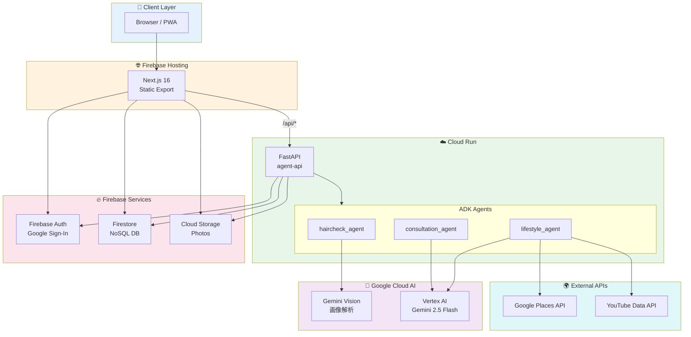
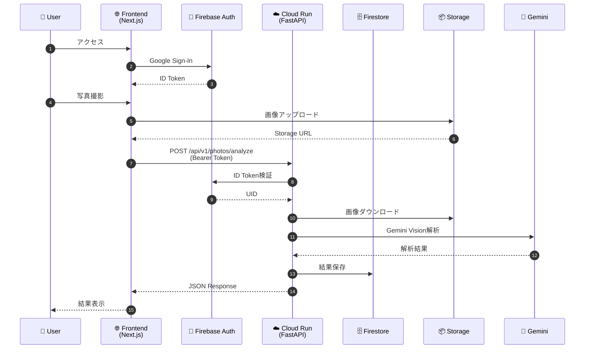
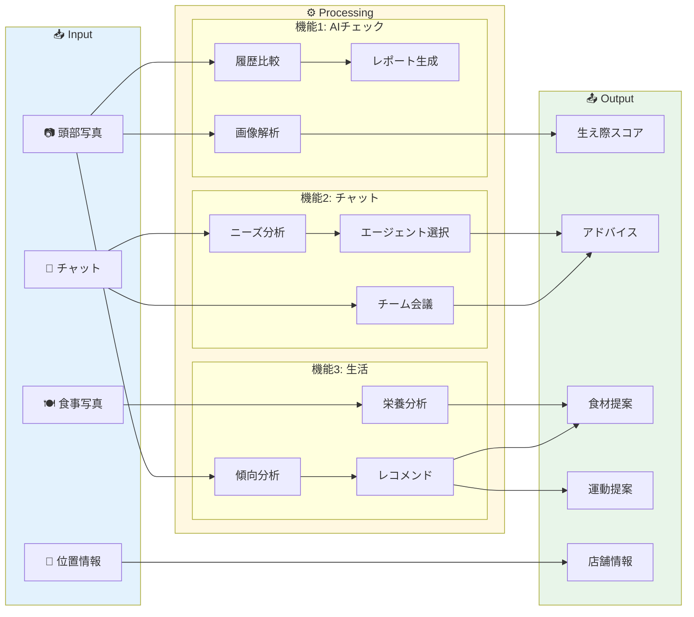
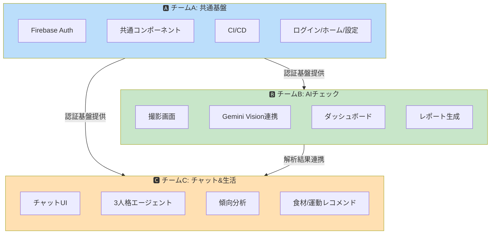
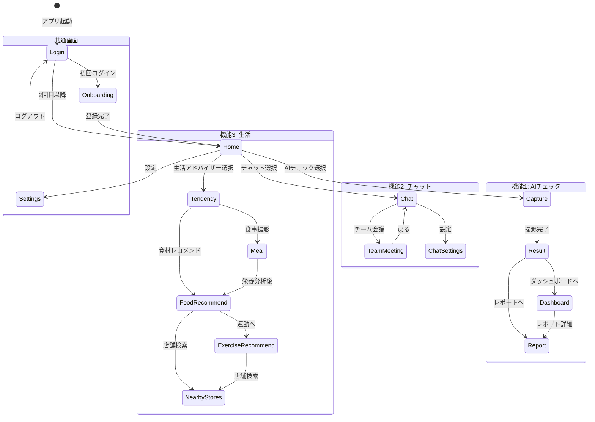
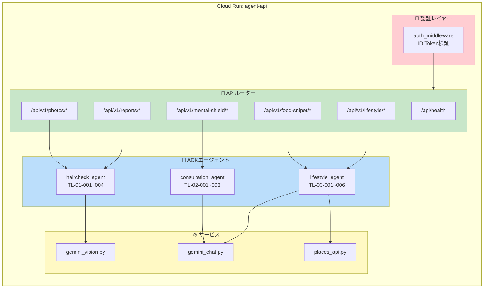
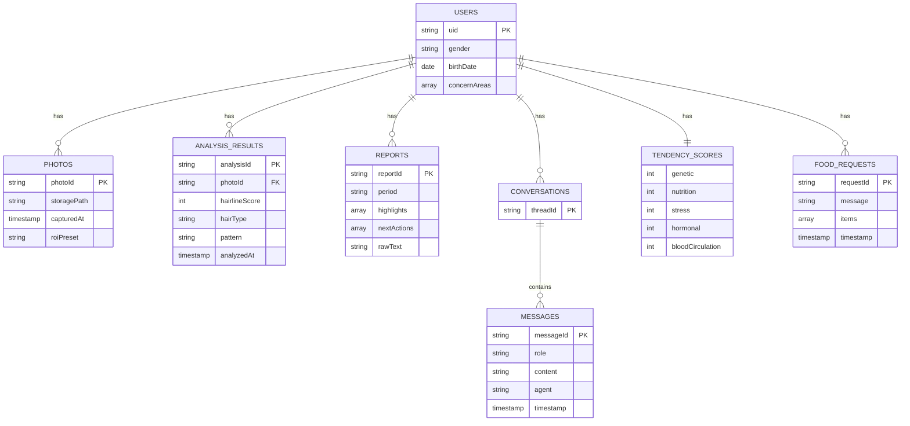

# HairGuard Agent チーム分担書

最終更新: 2026-02-02

---

## 1. システム構成 / アーキテクチャ

### 1.1 全体アーキテクチャ



### 1.2 リクエストフロー



### 1.3 データフロー



### 1.4 チーム担当領域



---

### 1.5 画面遷移図



### 1.6 API構成図



### 1.7 Firestoreデータ構造



---

## 2. 画面一覧（フロントエンド）

### 2.1 Mockファイル構成（参考）

```
mock/src/screens/
├── Index.jsx              # 画面一覧インデックス
├── common/                # 共通画面
│   ├── Login.jsx         # SCR-00-01 ログイン
│   ├── Profile.jsx       # SCR-00-02 プロフィール
│   ├── Home.jsx          # SCR-00-03 ホーム
│   └── Settings.jsx      # SCR-00-04 設定
├── feature1/              # 機能1: AIチェック
│   ├── Capture.jsx       # SCR-01-01 撮影ガイド＆撮影
│   ├── Result.jsx        # SCR-01-02 解析結果
│   ├── Dashboard.jsx     # SCR-01-03 ダッシュボード
│   └── Report.jsx        # SCR-01-04 レポート詳細
├── feature2/              # 機能2: チャットボット
│   ├── Chat.jsx          # SCR-02-01 チャット
│   ├── TeamMeeting.jsx   # SCR-02-02 チーム会議モード
│   └── ChatSettings.jsx  # SCR-02-03 チャット設定
└── feature3/              # 機能3: 生活アドバイザー
    ├── Tendency.jsx      # SCR-03-01 傾向分析結果
    ├── Meal.jsx          # SCR-03-02 食事撮影＆栄養分析
    ├── FoodRecommend.jsx # SCR-03-03 食材レコメンド
    ├── ExerciseRecommend.jsx # SCR-03-04 運動レコメンド
    └── NearbyStores.jsx  # SCR-03-05 近くの店舗
```

※ 現行のデプロイでは mock は使用しない（ビルド/配信対象外）

### 2.2 全画面一覧

| 画面ID | 画面名 | パス | 概要 | 担当チーム |
|--------|--------|------|------|-----------|
| SCR-00-01 | ログイン | `/login` | Google Sign-In | A |
| SCR-00-02 | オンボーディング | `/onboarding` | 性別・生年月日・気になる部位を登録（初回ログイン後） | A |
| SCR-00-03 | ホーム | `/home` | 3機能への導線 | A |
| SCR-00-04 | 設定 | `/settings` | 通知・プライバシー | A |
| SCR-01-01 | 撮影ガイド＆撮影 | `/feature1/capture` | AIガイド撮影 | B |
| SCR-01-02 | 解析結果 | `/feature1/result` | 髪密度・タイプ判定 | B |
| SCR-01-03 | ダッシュボード | `/feature1/dashboard` | 時系列グラフ | B |
| SCR-01-04 | レポート詳細 | `/feature1/report` | AI生成レポート | B |
| SCR-02-01 | チャット | `/feature2/chat` | AIチャット対話 | C |
| SCR-02-02 | チーム会議 | `/feature2/team-meeting` | 3視点アドバイス | C |
| SCR-02-03 | チャット設定 | `/feature2/settings` | 対応スタイル調整 | C |
| SCR-03-01 | 傾向分析 | `/feature3/tendency` | 5項目スコア表示 | C |
| SCR-03-02 | 食事撮影 | `/feature3/meal` | 栄養分析 | C |
| SCR-03-03 | 食材レコメンド | `/feature3/food-recommend` | 食材提案 | C |
| SCR-03-04 | 運動レコメンド | `/feature3/exercise-recommend` | 運動提案 | C |
| SCR-03-05 | 近くの店舗 | `/feature3/nearby-stores` | 店舗地図表示 | C |

---

## 3. API一覧（バックエンド）

### 3.1 エンドポイント一覧

| メソッド | パス | 説明 | 認証 | 担当チーム |
|---------|------|------|------|-----------|
| GET | `/api/health` | ヘルスチェック | 不要 | A |
| POST | `/api/v1/photos/analyze` | 画像解析（生え際スコア） | 必須 | B |
| POST | `/api/v1/reports/generate` | 週次/月次レポート生成 | 必須 | B |
| POST | `/api/v1/mental-shield/chat` | 3人格メンタル支援 | 必須 | C |
| POST | `/api/v1/food-sniper/recommend` | 食材/店舗提案 | 必須 | C |
| POST | `/api/v1/lifestyle/tendency` | 傾向分析スコア算出 | 必須 | C |
| POST | `/api/v1/lifestyle/meal-analyze` | 食事写真栄養分析 | 必須 | C |
| GET | `/api/v1/lifestyle/tip` | ヒント生成（季節/時間帯） | 必須 | A |

### 3.2 主要リクエスト/レスポンス

#### `/api/v1/photos/analyze`
```json
// Request
{
  "photoId": "string",
  "storagePath": "users/{uid}/photos/{photoId}.jpg",
  "capturedAt": "ISO8601",
  "roiPreset": "forehead|crown"
}

// Response
{
  "analysisId": "string",
  "hairlineScore": 0-100,
  "deltaVsPrev": "+3%",
  "deltaVsBase": "-5%",
  "hairType": "II型vertex",
  "pattern": "M字",
  "quality": "good|fair|poor"
}
```

#### `/api/v1/mental-shield/chat`
```json
// Request
{
  "threadId": "string",
  "message": "最近抜け毛が気になります",
  "mode": "auto|supporter|coach|doctor"
}

// Response
{
  "cards": [
    { "agent": "supporter", "text": "心配されていますね..." },
    { "agent": "coach", "text": "具体的にできることは..." },
    { "agent": "doctor", "text": "医学的には..." }
  ],
  "summary": "総括アドバイス",
  "selectedAgent": "supporter"
}
```

#### `/api/v1/food-sniper/recommend`
```json
// Request
{
  "message": "亜鉛が多い食材を教えて",
  "location": { "lat": 35.681, "lng": 139.767, "accuracyM": 10 },
  "radiusM": 500
}

// Response
{
  "items": [
    { "food": "牡蠣", "reason": "亜鉛が豊富", "nutrients": ["亜鉛"] }
  ],
  "stores": [
    { "name": "〇〇スーパー", "address": "...", "distance": "300m" }
  ],
  "shoppingList": ["牡蠣 100g", "納豆 1パック"]
}
```

---

## 4. Firestoreコレクション設計

```
users/{uid}
├── profile                    # オンボーディング情報
│   ├── gender: "male" | "female"
│   ├── birthDate: date        # 生年月日
│   └── concernAreas: string[] # 気になる部位（"forehead" | "crown" | "temples" | "overall"）
│
├── photos/{photoId}           # 撮影写真
│   ├── storagePath: string
│   ├── capturedAt: timestamp
│   └── roiPreset: string
│
├── analysisResults/{analysisId}  # 解析結果
│   ├── photoId: string
│   ├── hairlineScore: number
│   ├── hairType: string
│   ├── pattern: string
│   └── analyzedAt: timestamp
│
├── reports/{reportId}         # レポート
│   ├── period: "weekly" | "monthly"
│   ├── highlights: string[]
│   ├── nextActions: string[]
│   └── rawText: string
│
├── conversations/{threadId}   # チャット会話
│   └── messages/{messageId}
│       ├── role: "user" | "ai"
│       ├── content: string
│       ├── agent?: string
│       └── timestamp: timestamp
│
├── tendencyScores             # 傾向スコア
│   ├── genetic: number
│   ├── nutrition: number
│   ├── stress: number
│   ├── hormonal: number
│   └── bloodCirculation: number
│
└── foodRequests/{requestId}   # 食材リクエスト履歴
    ├── message: string
    ├── items: array
    └── timestamp: timestamp
```

---

## 5. チーム分担

### 5.1 チーム構成

| チーム | 担当領域 | 主要技術 |
|--------|---------|---------|
| **チームA** | 共通基盤・認証・インフラ | Firebase Auth, Cloud Run, CI/CD |
| **チームB** | 機能1: 生え際AIチェック | Gemini Vision, 画像解析, Chart.js |
| **チームC** | 機能2+3: チャット＆生活アドバイザー | Gemini, ADK Multi-agent |

### 5.2 チームA: 共通基盤チーム

**担当範囲**

| カテゴリ | 担当項目 |
|---------|---------|
| **フロント** | SCR-00-01〜04（ログイン/プロフィール/ホーム/設定） |
| **バック** | `/api/health`, 認証ミドルウェア |
| **インフラ** | Firebase設定, Cloud Run設定, CI/CD |
| **共通** | 共通コンポーネント, Firebase SDK初期化 |

**具体的タスク**

```
フロントエンド:
├── apps/web/src/lib/firebase.ts    # Firebase初期化
├── apps/web/src/lib/auth.ts        # 認証ロジック
├── apps/web/src/app/login/         # ログイン画面
├── apps/web/src/app/profile/       # プロフィール画面
├── apps/web/src/app/home/          # ホーム画面
├── apps/web/src/app/settings/      # 設定画面
└── apps/web/src/components/        # 共通コンポーネント
    ├── Layout.tsx
    ├── Header.tsx
    ├── BottomNav.tsx
    ├── Button.tsx
    ├── Card.tsx
    └── PhoneFrame.tsx

バックエンド:
├── services/agent-api/app/main.py          # FastAPIエントリ
├── services/agent-api/app/auth/            # 認証ミドルウェア
└── services/agent-api/app/routers/health.py # ヘルスチェック

インフラ:
├── firebase.json                    # Firebase設定
├── firestore.rules                  # セキュリティルール
├── storage.rules                    # Storageルール
└── .github/workflows/               # CI/CDパイプライン
    ├── firebase-hosting-merge.yml
    └── cloud-run-deploy.yml
```

**成果物**

| 成果物 | 期限 | 備考 |
|--------|------|------|
| Firebase Auth統合 | Day 2 | Google Sign-In |
| 認証ミドルウェア | Day 2 | ID Token検証 |
| 共通コンポーネント | Day 2 | Mock移植 |
| CI/CDパイプライン | Day 3 | 自動デプロイ |
| 共通画面4画面 | Day 3 | Mock移植 |

---

### 5.3 チームB: 機能1（AIチェック）チーム

**担当範囲**

| カテゴリ | 担当項目 |
|---------|---------|
| **フロント** | SCR-01-01〜04（撮影/解析結果/ダッシュボード/レポート） |
| **バック** | `/api/v1/photos/analyze`, `/api/v1/reports/generate` |
| **AI** | Gemini Vision画像解析, レポート生成 |

**具体的タスク**

```
フロントエンド:
├── apps/web/src/app/feature1/
│   ├── capture/page.tsx           # 撮影ガイド＆撮影
│   ├── result/page.tsx            # 解析結果表示
│   ├── dashboard/page.tsx         # 時系列グラフ
│   └── report/page.tsx            # レポート詳細
└── apps/web/src/components/
    └── ScoreCircle.tsx            # スコア表示コンポーネント

バックエンド:
├── services/agent-api/app/routers/
│   ├── photos.py                  # 画像解析API
│   └── reports.py                 # レポート生成API
├── services/agent-api/app/agents/
│   └── haircheck_agent/
│       ├── __init__.py
│       ├── agent.py               # ADKエージェント
│       └── tools/
│           ├── analyze_hair_image.py   # TL-01-001
│           ├── compare_with_history.py # TL-01-002
│           ├── generate_report.py      # TL-01-003
│           └── get_user_photos.py      # TL-01-004
└── services/agent-api/app/services/
    └── gemini_vision.py           # Gemini Vision連携
```

**API詳細**

| API | ADKツール | 処理内容 |
|-----|----------|---------|
| `/api/v1/photos/analyze` | TL-01-001 | 画像→Gemini Vision→生え際スコア算出 |
| `/api/v1/reports/generate` | TL-01-003 | 時系列データ→Gemini→自然言語レポート |

**成果物**

| 成果物 | 期限 | 備考 |
|--------|------|------|
| 撮影画面 | Day 2 | カメラ/ギャラリー連携 |
| 画像解析API | Day 3 | Gemini Vision統合 |
| 解析結果画面 | Day 3 | スコア・タイプ表示 |
| ダッシュボード | Day 4 | Chart.jsグラフ |
| レポート生成 | Day 4 | Gemini文章生成 |

---

### 5.4 チームC: 機能2+3（チャット＆生活）チーム

**担当範囲**

| カテゴリ | 担当項目 |
|---------|---------|
| **フロント** | SCR-02-01〜03, SCR-03-01〜05（計8画面） |
| **バック** | `/api/v1/mental-shield/*`, `/api/v1/food-sniper/*`, `/api/v1/lifestyle/*` |
| **AI** | ADKマルチエージェント（3人格）, 傾向分析 |

**具体的タスク**

```
フロントエンド:
├── apps/web/src/app/feature2/
│   ├── chat/page.tsx              # チャット画面
│   ├── team-meeting/page.tsx      # チーム会議モード
│   └── settings/page.tsx          # チャット設定
├── apps/web/src/app/feature3/
│   ├── tendency/page.tsx          # 傾向分析結果
│   ├── meal/page.tsx              # 食事撮影＆栄養分析
│   ├── food-recommend/page.tsx    # 食材レコメンド
│   ├── exercise-recommend/page.tsx # 運動レコメンド
│   └── nearby-stores/page.tsx     # 近くの店舗
└── apps/web/src/components/
    └── ChatBubble.tsx             # チャットUI

バックエンド:
├── services/agent-api/app/routers/
│   ├── mental_shield.py           # チャットAPI
│   ├── food_sniper.py             # 食材提案API
│   └── lifestyle.py               # 傾向分析API
├── services/agent-api/app/agents/
│   ├── consultation_agent/        # 機能2エージェント
│   │   ├── agent.py
│   │   ├── personas/
│   │   │   ├── supporter.py       # サポーター視点
│   │   │   ├── coach.py           # コーチ視点
│   │   │   └── doctor.py          # ドクター視点
│   │   └── tools/
│   │       ├── analyze_user_need.py     # TL-02-001
│   │       ├── get_conversation_context.py # TL-02-002
│   │       └── trigger_team_meeting.py  # TL-02-003
│   └── lifestyle_agent/           # 機能3エージェント
│       ├── agent.py
│       └── tools/
│           ├── get_hair_analysis.py     # TL-03-001
│           ├── analyze_tendency.py      # TL-03-002
│           ├── analyze_meal_photo.py    # TL-03-003
│           ├── recommend_foods.py       # TL-03-004
│           ├── recommend_exercises.py   # TL-03-005
│           └── search_nearby_stores.py  # TL-03-006
└── services/agent-api/app/services/
    ├── gemini_chat.py             # Geminiチャット
    └── places_api.py              # Google Places API
```

**API詳細**

| API | ADKツール | 処理内容 |
|-----|----------|---------|
| `/api/v1/mental-shield/chat` | TL-02-001〜003 | ニーズ分析→エージェント選択→応答生成 |
| `/api/v1/lifestyle/tendency` | TL-03-001〜002 | 解析結果取得→傾向スコア算出 |
| `/api/v1/lifestyle/meal-analyze` | TL-03-003 | 食事写真→栄養分析 |
| `/api/v1/food-sniper/recommend` | TL-03-004〜006 | 傾向→食材レコメンド＋店舗検索 |

**成果物**

| 成果物 | 期限 | 備考 |
|--------|------|------|
| チャット画面 | Day 2 | 基本UI |
| 3人格エージェント | Day 3 | ADKマルチエージェント |
| チーム会議機能 | Day 3 | 3視点表示 |
| 傾向分析 | Day 3 | 5項目スコア |
| 食事撮影/栄養分析 | Day 4 | Gemini Vision |
| 食材/運動レコメンド | Day 4 | レコメンドロジック |
| 店舗検索 | Day 5 | Google Places API |

---

## 6. フォルダ構成（実装）

```
hackason-grav/
├── apps/
│   └── web/                           # Next.js (フロント)
│       ├── src/
│       │   ├── app/                   # App Router
│       │   │   ├── login/            # チームA
│       │   │   ├── profile/          # チームA
│       │   │   ├── home/             # チームA
│       │   │   ├── settings/         # チームA
│       │   │   ├── feature1/         # チームB
│       │   │   ├── feature2/         # チームC
│       │   │   └── feature3/         # チームC
│       │   ├── lib/                   # チームA
│       │   │   ├── firebase.ts
│       │   │   └── auth.ts
│       │   └── components/            # チームA（共通）
│       └── .env.local
│
├── services/
│   └── agent-api/                     # FastAPI (Cloud Run)
│       ├── app/
│       │   ├── main.py               # チームA
│       │   ├── auth/                 # チームA
│       │   ├── routers/
│       │   │   ├── health.py         # チームA
│       │   │   ├── photos.py         # チームB
│       │   │   ├── reports.py        # チームB
│       │   │   ├── mental_shield.py  # チームC
│       │   │   ├── food_sniper.py    # チームC
│       │   │   └── lifestyle.py      # チームC
│       │   ├── agents/
│       │   │   ├── haircheck_agent/  # チームB
│       │   │   ├── consultation_agent/ # チームC
│       │   │   └── lifestyle_agent/  # チームC
│       │   └── services/
│       │       ├── gemini_vision.py  # チームB
│       │       ├── gemini_chat.py    # チームC
│       │       └── places_api.py     # チームC
│       └── requirements.txt
│
├── firestore.rules                    # チームA
├── storage.rules                      # チームA
├── firebase.json                      # チームA
└── docs/                              # 共通
```

---

## 7. 開発スケジュール（5日間）

### 7.1 タイムライン

```
Day 1 (準備)
├── チームA: Firebase/Cloud Run初期設定、CI/CD構築
├── チームB: Mock→Next.js移植準備、Gemini API調査
└── チームC: Mock→Next.js移植準備、ADK調査

Day 2 (基盤＆UI)
├── チームA: 認証完成、共通コンポーネント、共通画面4画面
├── チームB: 撮影画面、解析結果画面（UI部分）
└── チームC: チャット画面、傾向分析画面（UI部分）

Day 3 (API連携)
├── チームA: Firestore設定完了、チーム間連携サポート
├── チームB: 画像解析API、解析結果表示連携
└── チームC: チャットAPI、3人格エージェント

Day 4 (機能実装)
├── チームA: バグ修正、パフォーマンス最適化
├── チームB: ダッシュボード、レポート生成
└── チームC: 食事分析、食材/運動レコメンド

Day 5 (仕上げ)
├── チームA: 最終デプロイ、全体統合テスト
├── チームB: 最終調整、デモ準備
└── チームC: 店舗検索、最終調整、デモ準備
```

### 7.2 依存関係

```
チームA（認証・インフラ）
    ↓ 認証完成後
チームB・C（各機能実装開始）
    ↓ 基本画面完成後
全チーム（結合テスト）
```

---

## 8. 環境変数

### 8.1 フロント（.env.local）

```env
NEXT_PUBLIC_FIREBASE_API_KEY=xxx
NEXT_PUBLIC_FIREBASE_AUTH_DOMAIN=xxx.firebaseapp.com
NEXT_PUBLIC_FIREBASE_PROJECT_ID=xxx
NEXT_PUBLIC_FIREBASE_STORAGE_BUCKET=xxx.appspot.com
NEXT_PUBLIC_FIREBASE_MESSAGING_SENDER_ID=xxx
NEXT_PUBLIC_FIREBASE_APP_ID=xxx
NEXT_PUBLIC_API_BASE=https://agent-api-xxx-an.a.run.app
```

---

## 8.x 共通API/認証の使い方（チームA提供）

### 8.x.1 認証フロー（初回/2回目以降）

- 初回ログイン: Firebase Auth → `users/{uid}/profile/default` が未作成 → `/onboarding`
- 2回目以降: プロフィール存在 → `/home`

### 8.x.2 API 呼び出し（Bearer 自動付与）

共通ユーティリティ `apps/web/src/lib/api.ts` を利用する。

```ts
import { apiFetch } from "@/lib/api";

// 例: 画像解析
const res = await apiFetch("/api/v1/photos/analyze", {
  method: "POST",
  headers: { "Content-Type": "application/json" },
  body: JSON.stringify(payload),
});
```

### 8.x.3 401/未ログイン時の挙動

- `Layout` が未認証の場合 `/login` へリダイレクト  
- プロフィール未登録の場合 `/onboarding` へ誘導  

### 8.x.4 Cloud Run 認証ポリシー（本番）

- **本番は認証必須**（`ALLOW_UNAUTHENTICATED=false`）  
- Cloud Run の `allUsers` / `allAuthenticatedUsers` に `roles/run.invoker` を付与しない  
- 未認証アクセスは **401/403** になる想定  

---

## 8.y Firestore パス一覧（共通）

`users/{uid}` をルートにデータを配置する。

```
users/{uid}/profile/default
users/{uid}/photos/{photoId}
users/{uid}/analysisResults/{analysisId}
users/{uid}/reports/{reportId}
users/{uid}/conversations/{threadId}/messages/{messageId}
users/{uid}/tendencyScores/{scoreId}
users/{uid}/foodRequests/{requestId}
```

フロント側の共通ヘルパ: `apps/web/src/lib/paths.ts`

### 8.2 バック（Cloud Run環境変数）

```env
FIREBASE_PROJECT_ID=xxx
FIREBASE_STORAGE_BUCKET=xxx.appspot.com
ALLOWED_ORIGINS=https://xxx.web.app
DEBUG_AUTH=false
GOOGLE_CLOUD_PROJECT=xxx
GOOGLE_CLOUD_LOCATION=asia-northeast1
GOOGLE_GENAI_USE_VERTEXAI=true
GEMINI_MODEL=gemini-2.5-flash
GEMINI_MODEL_LIGHT=gemini-2.5-flash
GEMINI_MODEL_HEAVY=gemini-2.5-pro
GEMINI_ENABLED=true
```

---

## 9. 連絡・共有

### 9.1 コミュニケーション

| 用途 | ツール |
|------|--------|
| リアルタイム連絡 | Slack / Discord |
| タスク管理 | GitHub Issues |
| ドキュメント | このドキュメント |
| コード共有 | GitHub PR |

### 9.2 ブランチ戦略

```
main                    # 本番
├── develop            # 開発統合
│   ├── feature/team-a/auth     # チームA
│   ├── feature/team-b/capture  # チームB
│   └── feature/team-c/chat     # チームC
```

---

## 10. 運用チェックリスト（チームB/C向け共有）

### 10.1 必須Secrets/Variables（GitHub Actions）

- `GCP_PROJECT_ID` / `GCP_REGION` / `CLOUD_RUN_SERVICE`
- `GCP_SA_KEY`
- `ALLOW_UNAUTHENTICATED`（本番は `false`）
- `ALLOWED_ORIGINS`（複数可）
- `NEXT_PUBLIC_API_BASE`
- `GEMINI_MODEL_LIGHT` / `GEMINI_MODEL_HEAVY`
- `NEXT_PUBLIC_FIREBASE_*` 一式

### 10.2 デプロイ後の確認

- Cloud Run（未認証）: **401/403** を返す  
- Hosting ルート `/` は **ログイン画面**  
- 初回ログインは `/onboarding`、登録後は `/home`  

### 10.3 Storage ルールの注意

- 現状は `users/{uid}/photos/*` のみ許可  
- 食事画像など別パスを使う場合は **storage.rules の拡張が必要**

---

## 変更履歴

| 日付 | 変更内容 |
|------|---------|
| 2026-02-02 | 初版作成 |
| 2026-02-02 | Mermaidアーキテクチャ図追加（全体構成/リクエストフロー/データフロー/チーム担当/画面遷移/API構成/ER図） |
| 2026-02-02 | オンボーディング画面仕様更新（年齢→生年月日、悩み→気になる部位） |
